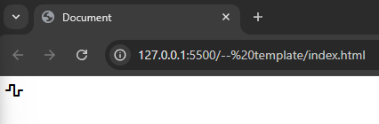
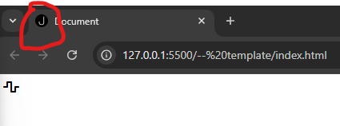
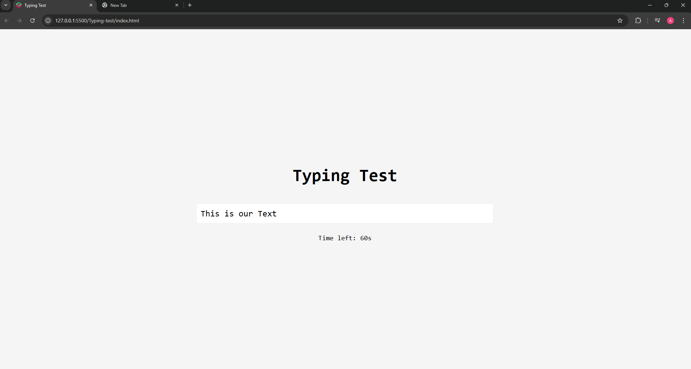
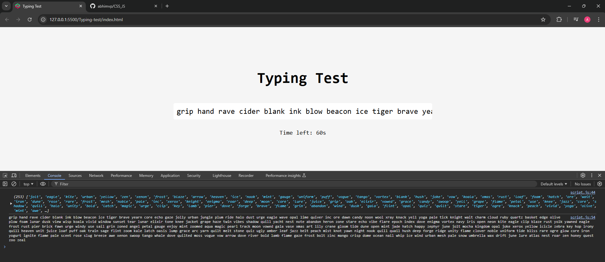

# CSS_JS

All the resources needed for the course can be found in this [Course Handbook](https://sweet-tellurium-e16.notion.site/JS-CSS-Projects-Handbook-12ab2273e75280118369d9af8a6a9622), including the GitHub repo, links, and more! So definitely bookmark it now and keep it handy.

## -- template

- The reason to name it -- (two dashes at the start of the folder , if we sort the folder alphabetically this folder will be at top automatically).
- create three template files - script.js , style.css , index.html & link the js and css file to html for them to work using `link` in `head`
- Add icons from this site v5 [link](https://fontawesome.com/v5/search?o=r&m=free) & to access this stylesheet hosted externally we need another site [cdnjs](https://cdnjs.com/libraries/font-awesome)
- use `atl+z` to word wrap in vscode
- Now select icon we want and copy the html code and paste it in our html file in the body and we can see the icon display on our page .. cool right.

  

- `favicon` - is the little icon we see on the browser tab which is logo of that side or company - current our project has blank file/world logo from above picture - adding it would make our project look professional & we can get the favicons from this [link](https://css-tricks.com/favicons-next-to-external-links/) instead of files in our repo and we see we have our icon
  
- In this project we will add a local file to display favicon & add some styling

## DevTools - chrome

- let's look into [documentation](https://developer.chrome.com/docs/devtools/overview)
- box-shadow feature in chromedevtools and how to play around other tools [link](https://academy.zerotomastery.io/courses/front-end-projects/lectures/58383348)

## Typing Test - Project

- As usual let's make use of template folder to setup our project and copy it and paste and rename it to `Typing-test`
- we can make use of autocompletions in vscode type in `div#text-container` and enter gives us `

`
- After building out MAIN UI components:

  

- `Shuffle & Generate Text JS`: Above UI is sorted out , let's get into functionality.
- We will be making use non-repeating words array from the author [repo](https://github.com/JacintoDesign/typing-test/blob/main/words.json) and copy the content from that file and add them into our project script.js file.
- added the long text from the above words into the text-container
  
